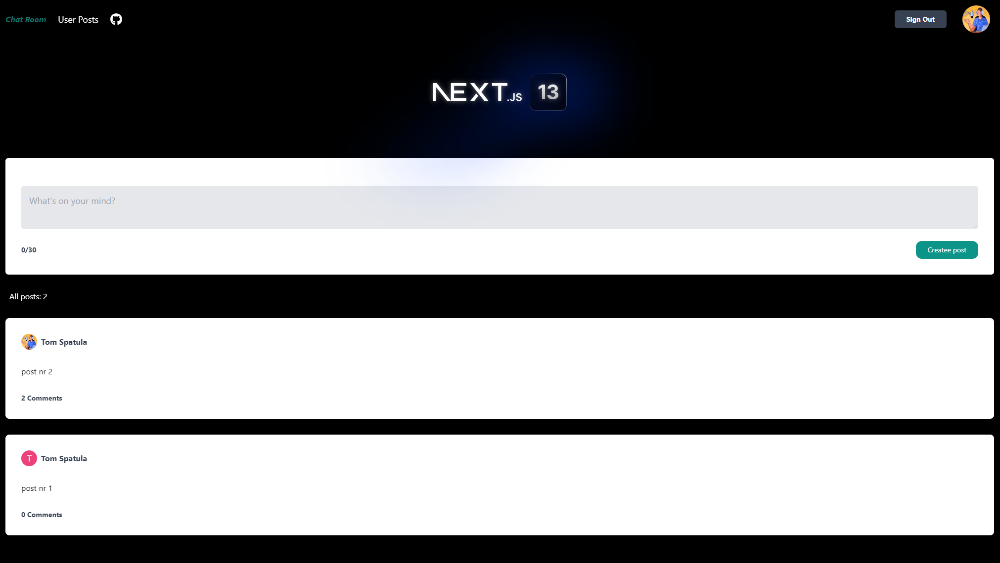

# Chat Room - Next.js App Router migration sandbox

[View the deployed app on Vercel](https://testing-next-13-beta-typescript-tailwind-prisma.vercel.app/)

## Table of Contents

- [Current State](#current-state)
- [What the App Does](#what-the-app-does)
- [Current Routes](#current-routes)
- [Stack and Architecture](#stack-and-architecture)
- [Local Development](#local-development)
- [Modernization Tracks](#modernization-tracks)
- [Legacy Migration Notes](#legacy-migration-notes)

## Current State

This repository keeps the original "Chat Room" identity, but today it is best read as a full-stack Next.js migration sandbox rather than a real-time chat product. The app started as a Next.js 13 beta experiment in 2023 and has been carried forward through the later App Router releases; the current codebase runs on Next.js 16.2.1, React 19.2.4, Prisma 7.4.2, NextAuth.js v5 beta, and Tailwind CSS 4.2.1.

The goal of this README is to make the current state obvious without deleting the older notes that show the learning process. The original Next.js 13 beta write-up is preserved later in this file as legacy migration history.

## What the App Does

Authenticated users can:

- sign in with Google
- create short posts on the home feed
- open a single post page and add comments
- view and manage their own posts on `/userposts`

All visitors can browse the feed and use the app as a reference project for App Router patterns, Server Components, Cache Components, Prisma-backed data access, and a few experimental rendering demos.

## Current Routes

| Route | Purpose |
| --- | --- |
| `/` | Home feed with cached server-rendered posts and the add-post form |
| `/[post]` | Single-post page with comments |
| `/userposts` | Protected dashboard for the signed-in user's posts |
| `/halftone-waves` | Experimental route for server rendering and visual loading demos |
| `/deep-galaxy` | Experimental route for async rendering and Suspense behavior |
| `/edit-suggestions` | Placeholder route for future editing workflows |
| `/privacypolicy` | Google privacy policy page |

## Stack and Architecture

### Runtime stack

- Next.js 16.2.1
- React 19.2.4
- TypeScript 5.9.3
- NextAuth.js 5.0.0-beta.25 with Google OAuth
- Prisma 7.4.2 with PostgreSQL
- Tailwind CSS 4.2.1
- TanStack Query 5.90.21

### App shape

- `app/` holds the App Router routes.
- Route groups such as `(experimental)` keep demo routes organized without changing URLs.
- Private underscore-prefixed folders are reserved for colocated implementation details.
- `lib/cache/` holds cached server-side data helpers.
- `prisma/` holds the schema and migrations.
- `types/` holds shared TypeScript types.
- `public/` holds static assets.

### Current implementation notes

- Cache Components are enabled in `next.config.ts`.
- The home feed uses `'use cache'` together with `cacheLife('max')`.
- Authentication uses a shared `auth.js` config plus App Router route handlers.
- The project still keeps some `.js` files alongside TypeScript, so `allowJs` remains enabled.

## Local Development

1. Install dependencies with `npm install`.
2. Add the required database and Google auth environment variables to `.env`.
3. Start the dev server with `npm run dev`.
4. Open [http://localhost:3000](http://localhost:3000).

Useful scripts:

- `npm run dev` - Next.js dev server with Turbopack
- `npm run dev:webpack` - force Webpack dev mode
- `npm run dev:inspect` - start dev mode with Node inspector support
- `npm run lint`
- `npm run build`

### Windows note for Turbopack

If Windows blocks symlink creation for Turbopack, enable Developer Mode or run the terminal as Administrator before starting `npm run dev`.

## Modernization Tracks

This repo keeps the upgrade history visible instead of rewriting it away. Each major pass gets its own issue thread so the cleanup work stays reviewable and the learning trail stays intact.

### Completed tracks

- Next.js 13 -> 14: stabilized App Router adoption and early experimental APIs
- Next.js 14 -> 15: refreshed data patterns and dependency alignment
- Next.js 15 -> 16: React 19 migration and Cache Components adoption

### Current follow-up issues

1. [#34 Reconcile dependency and build tooling](https://github.com/spatulatom/testing-next-13-beta-typescript-tailwind-prisma/issues/34)
2. [#35 Migrate metadata and head handling to the Metadata API](https://github.com/spatulatom/testing-next-13-beta-typescript-tailwind-prisma/issues/35)
3. [#36 Reduce client-only surface area and adopt modern Server Actions patterns](https://github.com/spatulatom/testing-next-13-beta-typescript-tailwind-prisma/issues/36)
4. [#37 Modernize auth integration and route handler contracts](https://github.com/spatulatom/testing-next-13-beta-typescript-tailwind-prisma/issues/37)
5. [#38 Standardize Cache Components and revalidation strategy](https://github.com/spatulatom/testing-next-13-beta-typescript-tailwind-prisma/issues/38)
6. [#39 Clean repo hygiene, TypeScript config, and docs](https://github.com/spatulatom/testing-next-13-beta-typescript-tailwind-prisma/issues/39)
7. [#51 Finish Tailwind 4 migration and verify UI](https://github.com/spatulatom/testing-next-13-beta-typescript-tailwind-prisma/issues/51)
8. [#52 Resolve remaining ESLint backlog](https://github.com/spatulatom/testing-next-13-beta-typescript-tailwind-prisma/issues/52)

## Legacy Migration Notes

The sections below are intentionally preserved from the original Next.js 13 beta era so the repo still shows the learning path from the first App Router experiments to the current codebase.

### Original README from the Next.js 13 beta phase

This is a Next.js 13 Beta project integrated with TypeScript, styled with combination of <a href='https://tailwindcss.com/'>Tailwind CSS</a> and CSS modules. The application is named 'Chat Room'.
<a name="readme-top"></a>

<div align="left">
<p>
   <a href="https://testing-next-13-beta-typescript-tailwind-prisma.vercel.app/"><strong>View the deployed app on Vercel »</strong></a>
    <br />
        <br />
   
  </p>
</div>

<!-- TABLE OF CONTENTS -->
<details>
  <summary>Table of Contents</summary>
  <ol>
  <li><a href="#next-13-beta-and-later-versions">Next.js 13 Beta and later versions</a></li>
    <li><a href="#about-the-project">About The Project</a></li>
    <li><a href="#mutating-data">Mutating Data with new Server Components</a></li>
    <li><a href="#backend">Backend an new Route Handlers</a></li>
       <li><a href="#error-handling-and-loading-ui">Error handling and Loading UI</a></li>
         <li><a href="#authentication">Authentication with NextAuth.js</a></li>
     <li><a href="#new-features">Other new features used in the app</a></li>
      <li><a href="#typescript">TypeScript</a></li>
    <li><a href="#built-with">Built With</a></li>
     <li><a href="#getting-started">Getting Started</a></li>
   
  </ol>
</details>

<!-- ABOUT THE PROJECT -->

## Next 13 Beta and later versions:

The project was built a few months ago, around the middle of 2023. Since then, the Beta version of Next.js 13 has transitioned to full production, and numerous features tested in this app have been recognized and incorporated by Next.js. These improvements include enhancements to data mutation processes, among others. Notably, as of October 26th, Next.js 14 has been released.

## About The Project

This project explores many different features introduced by the Next.js 13 Beta update. Some of these features were not recommended for full-scale production just yet (when the app was built in 2023), as this version of Next.js is still being developed and worked on.

'Chat room' is a fullstack CRUD app, consisting of the frontend and the backend sections. Lines between frontend/backend in the case of Next.js 13 Beta are blurred with the introduction of server components, yet files that are strictly 'backend' can be found in pages/api and in app/api. As for the frontend, I am using the new app directory with new server components in it.
<br />

The app has three main functionalities allowing users to:

- login in with your Google account through NextAuth.js,
- CREATE a post,
- CREATE a comment,
- DELETE a post (with comments).



<p align="right">(<a href="#readme-top">back to top</a>)</p>

## Mutating Data

The aproach nr 1 described below is <a href='https://beta.nextjs.org/docs/data-fetching/mutating'>temporarly recommended by Next.js </a> team until a better one is developed.
</br>

1. CREATING a post && ADDING a comment are built with a combination of

- <a href = 'https://beta.nextjs.org/docs/rendering/server-and-client-components'>SERVER components</a>
- <a href='https://beta.nextjs.org/docs/data-fetching/fetching#asyncawait-in-server-components'>async/await sytnax wrapping those server componets </a> (new approach not allowed in previous versions of Next.js or in React.js),
- <a href ='https://beta.nextjs.org/docs/data-fetching/fetching'> new fetch() API</a> in those server components that allows configuration for SSG (static site generation) and SSR (server side rendering) - NO NEED for extra functions like getStaticProps or getServerSideProps,
- <a href='https://beta.nextjs.org/docs/data-fetching/mutating'>new useRouter Hook </a> imported from next/navigation (not form next/router like up until now) and a new router.refresh() method on it.

REVIEW: This app has many components thats use fetched data, some of those components only display that data, other components are mutating that data. There is no globally managed state that would hold that fetched data (like it usually happens in apps built with 'pure' React.js) instead each componets that uses the data fetches it directly from the databse or uses <a href='https://beta.nextjs.org/docs/data-fetching/caching'>default built in caching</a> and grabs the data from the cache.
</br> </br>
The problem is that we DONT KNOW when Next.js should use catch storage for getting the data or when it should freshy fetch the data from the database, as there is NO COMMUNICATION BETWEEN SERVER COMPONETS in the app on that matter. When one component mutates the data - let's say deletes an item, other componets DOES NOT KNOW about it, so when those other components are renderede, they need to fetch fresh data from the database JUST IN CASE the data was possibly mutated somewhere in the app, even though very often grabbing data from the cache storage would be completly sufficient.  
</br>
For that reason we can not obviously use SSG (and fetch data only at a built time in this app), (we have to use SSR instead), but more importantly we have to perform A LOT of data fetching. When we click links in navigation whenever those 'clicked' componets use data, they need to perform a fresh data fetch. By default in Next.js navigation is <a href='https://beta.nextjs.org/docs/data-fetching/caching'>soft </a>- it makes components use catching storage, so we need to modify it and make it a, so called, <a href='https://beta.nextjs.org/docs/routing/linking-and-navigating#hard-navigation'>hard navigation</a> to make sure data is grabbed not from the catche but fetched from database every time (this is where the useRouter refresh() method comes into play). That makes navigation between componets that use fetched data obviously much slower but ensures that every navigated page-to has a freshly feteched data.

2. DELETING  a post (with comments) is built for contrast with

- client components,
- Axios for data fetching,
- <a href='https://tanstack.com/query/v3/'>React Query for mutating data.</a>

REVIEW:
React Query HAS A WAY OF COMMUNICATING BETWEEN COMPONETS whether there was a data mutation in the app. If that's the case it performs a fresh data fetch, OTHERWISE it uses data stored in the catch. React Query KNOWS EXACTLY IF DATA WAS MUTATED in the app.
</br>Since we can leave all those fetching 'decisions' to React Query, we can go back to a default <a href='https://beta.nextjs.org/docs/routing/linking-and-navigating#conditions-for-soft-navigation'>soft navigation</a> between components in our app.
</br>
For those reasons mentioned above (until Next.js team finds a better way to mutate data in server components) using React Query gives a much smoother user experience.

<p align="right">(<a href="#readme-top">back to top</a>)</p>

## Backend

- Next.js 13 beta introduces <a href='https://beta.nextjs.org/docs/routing/route-handlers'>Route Handlers </a>, they can only be used inside of the new app directory in <strong>app/api </strong>as a replacement for <a href='https://beta.nextjs.org/docs/data-fetching/api-routes'>API routes </a> only used in <strong>pages/api</strong>
- for most of the API routes in this app I am using new approach placing the routes in the new app directory in <strong>app/api </strong>

- <a href='https://beta.nextjs.org/docs/routing/defining-routes#route-groups'>Route Groups</a> - new approach can be used for both front/backend routes,
  I am only using it on the backend, for example, in <strong>app/api/(homepage)/...</strong>

- <a href='https://www.prisma.io/'>Prisma</a> is used for data modeling and data is stored as PostgreSQL on <a href='https://supabase.com/'>Supabase</a>. The connection to Supabase is through Supavisor, a scalable, cloud-native Postgres connection pooler developed by Supabase (only available since January 2024 - before the connection was through PGBouncer, which together with IPv4 protocols connections got deprecated on Supabase as of the end of Jan 2024)

<p align="right">(<a href="#readme-top">back to top</a>)</p>

## Error Handling and Loading UI

For error handling in server components I have implemented:

- <a href='https://beta.nextjs.org/docs/routing/error-handling'>new error.tsx file</a> </br>
  For handling loading state in server components we have implemented:
- <a href='https://beta.nextjs.org/docs/routing/loading-ui'>new loading.tsx file</a> </br>
  ( For error handling and loading UI on the clint side we are using:
- <a href='https://react-hot-toast.com/'>React Hot Toast</a>)

<p align="right">(<a href="#readme-top">back to top</a>)</p>

## Authentication

- <a href='https://next-auth.js.org/'>NextAuth.js</a> is used for user authentication through their Google accounts. At the point the app was being built, NextAuth.js was not
supported in Next.js 13 Beta that is using the new App directory, and for that only reason in this app I also use the pages folder (that up until
now was the main folder for component composition and routing). Therefore this app is a hybrid between two ways of files structuring
in Next.js: uses experimental App directory for everything else, and all routes related to authentication are still being placed in <strong>pages/api folder</strong>

  <p align="right">(<a href="#readme-top">back to top</a>)</p>

## New Features

As for other new features introduced in Next.js 13 I have implemented:

- New next/image: Faster with native browser lazy loading in <strong>app/Logged.tsx</strong>
- new @next/font: Automatic self-hosted fonts with zero layout shift in <strong>app/page.tsx</strong>
- new next/link : Simplified API with automatic in <strong>app/Nav.tsx</strong>

<p align="right">(<a href="#readme-top">back to top</a>)</p>

## TypeScript

[`npx create-next-app@latest`](https://beta.nextjs.org/docs/installation) now ships with TypeScript by default. See ['TypeScript'](https://beta.nextjs.org/docs/configuring/typescript) for more information.
While implementing TypeScript into Next 13 beta I have been following these guidlines:

- <a href='https://nextjs.org/docs/basic-features/typescript'>TypeSript for Next.js </a> (BEFORE version 13 beta),
- TypeScript for new Next.js 13 beta features: <a href='https://beta.nextjs.org/docs/configuring/typescript'> here </a> and <a href='https://beta.nextjs.org/docs/routing/route-handlers#extended-nextrequest-and-nextresponse-apis'> here regarding new backend Route Handlers</a>

<p align="right">(<a href="#readme-top">back to top</a>)</p>

### Built With

- <a href='https://beta.nextjs.org/docs/getting-started'>Next.js 13 beta</a>,
- TypeScript,
- Tailwind CSS - for majority of styling,
  CSS modules - fading background of Next.js 13 logo,
- <a href='https://tanstack.com/query/v3/'>React Query</a>
- <a href='https://react-hot-toast.com/'>React Hot Toast</a> for notifications,
- NextAuth.js for users authentificaton,
- for data modeling and storage <a href='https://www.prisma.io/'>Prisma</a> && <a href='https://www.postgresql.org/'>PostgreSQL</a> stored in <a href='https://supabase.com/'>supabase</a>

<p align="right">(<a href="#readme-top">back to top</a>)</p>

## Getting Started

### Dev server notes (Next 16)

- `npm run dev` uses Turbopack by default.
- `npm run dev:webpack` forces Webpack (`--webpack`).
- If you want Node debugging without "address already in use" spam on port 9229 (Turbopack can spawn multiple processes), use `npm run dev:inspect`.

### Windows note (Turbopack symlinks)

If you run Turbopack on Windows and see an error like:

"create symlink to ..." / "A required privilege is not held by the client (os error 1314)"

Windows is blocking symbolic link creation.

Fix options (pick one):

1. Enable **Developer Mode** in Windows Settings (recommended)

- Settings → System → For developers → Developer Mode → On

2. Run VS Code / your terminal **as Administrator**

After that, run:

- `npm run dev` (Turbopack is default in Next 16)
- `npm run dev:webpack` (forces Webpack)

First, run the development server:

```bash
npm run dev
# or
yarn dev
# or
pnpm dev
```

Open [http://localhost:3000](http://localhost:3000) with your browser to see the result.

You can start editing the page by modifying `app/page.tsx`. The page auto-updates as you edit the file.

[API routes](https://nextjs.org/docs/api-routes/introduction) can be accessed on [http://localhost:3000/api/hello](http://localhost:3000/api/hello). This endpoint can be edited in `pages/api/hello.ts`.

The `pages/api` directory is mapped to `/api/*`. Files in this directory are treated as [API routes](https://nextjs.org/docs/api-routes/introduction) instead of React pages.

This project uses [`next/font`](https://nextjs.org/docs/basic-features/font-optimization) to automatically optimize and load Inter, a custom Google Font.

<p align="right">(<a href="#readme-top">back to top</a>)</p>

## Modernization Tracks

This project follows a **versioned modernization strategy**, where each major Next.js upgrade receives its own dedicated track. This approach enables systematic, measurable progress while keeping the codebase aligned with upstream best practices.

### Completed Tracks

- **Next.js 13 → 14**: Stabilized Server Components, Route Handlers, and experimental features
- **Next.js 14 → 15**: Streaming, enhanced middleware, TanStack Query v5 migration
- **Next.js 15 → 16**: React 19 migration, Cache Components preparation

### Active Track: Next.js 16 / React 19

**Status**: In Progress  
**Goal**: Full Next.js 16.1.6 + React 19 adoption with Cache Components ready  
**Pattern**: Each major version bump gets a dedicated README section at the end of this file

The current modernization pass is tracked in these GitHub issues. Resolve them in priority order:

1. [#34 Reconcile dependency and build tooling](https://github.com/spatulatom/testing-next-13-beta-typescript-tailwind-prisma/issues/34)
2. [#35 Migrate metadata and head handling to the Metadata API](https://github.com/spatulatom/testing-next-13-beta-typescript-tailwind-prisma/issues/35)
3. [#36 Reduce client-only surface area and adopt modern Server Actions patterns](https://github.com/spatulatom/testing-next-13-beta-typescript-tailwind-prisma/issues/36)
4. [#37 Modernize auth integration and route handler contracts](https://github.com/spatulatom/testing-next-13-beta-typescript-tailwind-prisma/issues/37)
5. [#38 Standardize Cache Components and revalidation strategy](https://github.com/spatulatom/testing-next-13-beta-typescript-tailwind-prisma/issues/38)
6. [#39 Clean repo hygiene, TypeScript config, and docs](https://github.com/spatulatom/testing-next-13-beta-typescript-tailwind-prisma/issues/39)

### Adding Future Tracks

When upgrading to a new major version (e.g., Next.js 17, 18):

1. Create a new GitHub milestone or issue set for that version
2. Add a new final `## Modernization Track - Next.js XX / React YY` section **at the end** of this README
3. Update the TOC to link to it
4. Move the previous track from "Active" to "Completed"

This keeps the active track always visible at a glance while preserving the upgrade history.

<p align="right">(<a href="#readme-top">back to top</a>)</p>

[linkedin-shield]: https://img.shields.io/badge/-LinkedIn-black.svg?style=for-the-badge&logo=linkedin&colorB=555
[linkedin-url]: https://www.linkedin.com/in/tomasz-s-069249244/
[product-screenshot]: images/screenshot.png
[next.js]: https://img.shields.io/badge/next.js-000000?style=for-the-badge&logo=nextdotjs&logoColor=white
[next-url]: https://nextjs.org/
[react.js]: https://img.shields.io/badge/React-20232A?style=for-the-badge&logo=react&logoColor=61DAFB
[react-url]: https://reactjs.org/
[vue.js]: https://img.shields.io/badge/Vue.js-35495E?style=for-the-badge&logo=vuedotjs&logoColor=4FC08D
[vue-url]: https://vuejs.org/
[angular.io]: https://img.shields.io/badge/Angular-DD0031?style=for-the-badge&logo=angular&logoColor=white
[angular-url]: https://angular.io/
[svelte.dev]: https://img.shields.io/badge/Svelte-4A4A55?style=for-the-badge&logo=svelte&logoColor=FF3E00
[svelte-url]: https://svelte.dev/
[laravel.com]: https://img.shields.io/badge/Laravel-FF2D20?style=for-the-badge&logo=laravel&logoColor=white
[laravel-url]: https://laravel.com
[bootstrap.com]: https://img.shields.io/badge/Bootstrap-563D7C?style=for-the-badge&logo=bootstrap&logoColor=white
[bootstrap-url]: https://getbootstrap.com
[jquery.com]: https://img.shields.io/badge/jQuery-0769AD?style=for-the-badge&logo=jquery&logoColor=white
[jquery-url]: https://jquery.com

