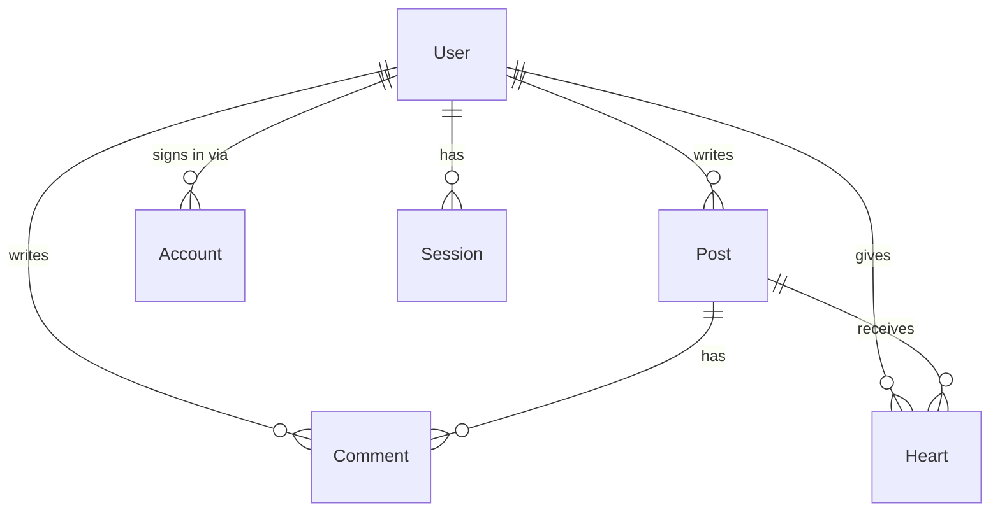

# From a Spreadsheet to a Schema

**A learning document.** How a junior engineer, handed the ticket *"design the data model for our blog app"*, would get from a blank Excel sheet to [schema.prisma](schema.prisma) — without writing a line of code first.

The point is to make the thinking visible. Every table below is something you could literally type into a spreadsheet and show a senior dev in a 20-minute meeting.

---

## Table of contents

- [**Chapter -1** — The ticket](#chapter--1--the-ticket)
  - [First move: write down the sentences](#first-move-write-down-the-sentences)
- [**Chapter 0** — The flat table (0NF)](#chapter-0--the-flat-table-0nf)
- [**Chapter 1** — First Normal Form](#chapter-1--first-normal-form)
  - [1NF, done properly — four sheets](#1nf-done-properly--four-sheets)
- [**Chapter 2** — Second Normal Form](#chapter-2--second-normal-form)
  - [After 2NF](#after-2nf)
- [**Chapter 3** — Third Normal Form](#chapter-3--third-normal-form)
  - [The 3NF model — final sheets](#the-3nf-model--final-sheets)
- [**Chapter 4** — The picture you actually put on the slide](#chapter-4--the-picture-you-actually-put-on-the-slide)
- [**Chapter 5** — The review meeting](#chapter-5--the-review-meeting)
  - [1. "Where do Google and GitHub logins live?"](#1-where-do-google-and-github-logins-live)
  - [2. "P1, U1 — where do those come from in production?"](#2-p1-u1--where-do-those-come-from-in-production)
  - [3. "Delete a post — what happens to its hearts?"](#3-delete-a-post--what-happens-to-its-hearts)
  - [4. "Add `updatedAt` to Post."](#4-add-updatedat-to-post)
- [**Chapter 6** — Sheets → Prisma](#chapter-6--sheets--prisma)
- [**Chapter 7** — Where the flat table comes back](#chapter-7--where-the-flat-table-comes-back)
- [**Chapter 8** — is this really how it's done?](#chapter-8--is-this-really-how-its-done)
- [**Chapter 9** — Junction tables vs. many-to-many relationships (a clarification)](#chapter-9--junction-tables-vs-many-to-many-relationships-a-clarification)
  - [The misconception](#the-misconception)
  - [What's actually happening](#whats-actually-happening)
  - [Why it's confusing](#why-its-confusing)
  - [The rule](#the-rule)
  - [The takeaway](#the-takeaway)
- [The three documents](#the-three-documents)

---

## Chapter -1 — The ticket

> **BLOG-14 — Design the data model**
>
> We're building a small blog. People sign in with Google or GitHub. They write posts. Other people comment on posts and can "heart" a post (one heart per person, and you can un-heart).
>
> Before you touch Prisma, sketch the model and walk us through it. — *Marta, tech lead*

So: don't open the editor. Open a spreadsheet.

### First move: write down the sentences

Before any table, the useful thing is to write the domain in plain English. Nouns become tables, verbs become relationships:

- A **user** writes many **posts**.
- A **post** belongs to exactly one user.
- A **user** writes many **comments**.
- A **comment** belongs to exactly one post and one user.
- A **user** can heart many posts; a **post** can be hearted by many users. *(the only many-to-many in the whole app)*
- A **user** signs in through one or more external **accounts** (Google, GitHub).

That list is already 80% of the schema. The spreadsheet work below is what convinces everyone — including you — that it's right.

---

## Chapter 0 — The flat table (0NF)

The honest first draft. You dump everything you know about the app into one sheet, one row per post, because that's how you'd describe it out loud.

**Sheet: `blog_stuff`**

| PostTitle | Author | AuthorEmail | Created | Published | Comments | HeartedBy |
| --- | --- | --- | --- | --- | --- | --- |
| Coffee at 3pm | Ana | ana@mail.com | 2026-03-01 | yes | Ben: "same energy"; Cleo: "3pm is late" | Ben, Cleo |
| My Vim setup | Ben | ben@mail.com | 2026-03-02 | yes | Ana: "nice"; Cleo: "use helix"; Ana: "no" | Ana |
| Draft thoughts | Ana | ana@mail.com | 2026-03-04 | no | | |
| Why I left Vim | Ben | ben@mail.com | 2026-03-05 | yes | Ana: "called it" | Ana, Cleo |

This is **0NF** — unnormalized. It *looks* fine in Excel. It's a disaster as a database. Say why out loud, because this is exactly what you'll be asked in the meeting:

| Problem | What breaks |
| --- | --- |
| **Multi-valued cells** | `HeartedBy = "Ben, Cleo"` — how do you count hearts? How do you remove *just* Ben's? String surgery. |
| **Repeating group** | The Comments cell holds a whole list, and each item has its own sub-structure (who + what). |
| **Update anomaly** | Ana changes her email. You must find and edit every row she appears in. Miss one → two Anas. |
| **Insert anomaly** | Cleo signs up but hasn't posted yet. There's no row to put her in. She doesn't exist. |
| **Delete anomaly** | Delete "My Vim setup" and you delete Cleo's only trace from the system. |
| **No identity** | Two posts could be titled "Draft thoughts". Nothing distinguishes them. |

Those four *anomaly* words are the vocabulary that makes this a design review instead of an opinion. Normalization is just the process of removing them one class at a time.

---

## Chapter 1 — First Normal Form

> **Rule:** every cell holds one value. No lists, no repeating groups. Every row is uniquely identifiable.

So you unpack the lists into rows. First attempt — and this is the instructive mistake, so make it deliberately:

**Sheet: `everything_1nf_attempt` (wrong)**

| PostID | PostTitle | Author | CommentID | CommentText | HeartedBy |
| --- | --- | --- | --- | --- | --- |
| P1 | Coffee at 3pm | Ana | C1 | same energy | Ben |
| P1 | Coffee at 3pm | Ana | C1 | same energy | Cleo |
| P1 | Coffee at 3pm | Ana | C2 | 3pm is late | Ben |
| P1 | Coffee at 3pm | Ana | C2 | 3pm is late | Cleo |

Post P1 has 2 comments and 2 hearts, and we just produced **4 rows**. Comment C1 is recorded twice — but it only happened once. This is the *cartesian product* / row fan-out problem, and it's the same trap that makes the naive feed query over-count in [RAW-SQL.md](RAW-SQL.md#3-queries).

**The lesson:** comments and hearts are two *independent* multi-valued facts about a post. Two independent lists cannot share one table. They need their own sheets.

### 1NF, done properly — four sheets

**Sheet: `Posts_1NF`**

| PostID | PostTitle | AuthorName | AuthorEmail | Created | Published |
| --- | --- | --- | --- | --- | --- |
| P1 | Coffee at 3pm | Ana | ana@mail.com | 2026-03-01 | TRUE |
| P2 | My Vim setup | Ben | ben@mail.com | 2026-03-02 | TRUE |
| P3 | Draft thoughts | Ana | ana@mail.com | 2026-03-04 | FALSE |
| P4 | Why I left Vim | Ben | ben@mail.com | 2026-03-05 | TRUE |

**Sheet: `Comments_1NF`** — key: (PostID, CommentID)

| PostID | CommentID | CommentText | CommenterName | CommenterEmail | PostTitle | CommentedAt |
| --- | --- | --- | --- | --- | --- | --- |
| P1 | C1 | same energy | Ben | ben@mail.com | Coffee at 3pm | 2026-03-01 |
| P1 | C2 | 3pm is late | Cleo | cleo@mail.com | Coffee at 3pm | 2026-03-02 |
| P2 | C3 | nice | Ana | ana@mail.com | My Vim setup | 2026-03-02 |
| P2 | C4 | use helix | Cleo | cleo@mail.com | My Vim setup | 2026-03-03 |
| P2 | C5 | no | Ana | ana@mail.com | My Vim setup | 2026-03-03 |
| P4 | C6 | called it | Ana | ana@mail.com | Why I left Vim | 2026-03-05 |

**Sheet: `Hearts_1NF`** — key: (PostID, UserName)

| PostID | UserName | UserEmail |
| --- | --- | --- |
| P1 | Ben | ben@mail.com |
| P1 | Cleo | cleo@mail.com |
| P2 | Ana | ana@mail.com |
| P4 | Ana | ana@mail.com |
| P4 | Cleo | cleo@mail.com |

**Sheet: `Users_1NF`** — you add this the moment you realize Cleo needs to exist before she posts

| UserName | UserEmail |
| --- | --- |
| Ana | ana@mail.com |
| Ben | ben@mail.com |
| Cleo | cleo@mail.com |

Better. Every cell is atomic, every row has a key. The insert anomaly is gone — Cleo has a home now.

Still broken: `ana@mail.com` appears in **eleven cells** across four sheets. Change it once and you have ten stale copies.

---

## Chapter 2 — Second Normal Form

> **Rule:** 1NF, *plus* — no non-key column may depend on only **part** of a composite key. (Only relevant where the key is composite.)

Look at `Comments_1NF`. Its key is **(PostID, CommentID)**. Now ask, column by column, *what does this actually depend on?*

| Column | Depends on | Verdict |
| --- | --- | --- |
| CommentText | CommentID | full key? no — **partial** |
| CommenterName | CommentID | **partial** |
| CommentedAt | CommentID | **partial** |
| PostTitle | **PostID only** | 🚨 **partial dependency** |

`PostTitle` sitting in the comments sheet is the violation you can *feel*: rename a post and you have to update every comment row. And `CommentID` turns out to be unique on its own — C4 is C4 regardless of which post it's on — so the composite key was never needed.

Same audit on `Hearts_1NF`, key **(PostID, UserName)**: `UserEmail` depends on `UserName` alone. Partial. Out it goes.

### After 2NF

**Sheet: `Posts_2NF`**

| PostID | PostTitle | AuthorName | AuthorEmail | Created | Published |
| --- | --- | --- | --- | --- | --- |
| P1 | Coffee at 3pm | Ana | ana@mail.com | 2026-03-01 | TRUE |
| P2 | My Vim setup | Ben | ben@mail.com | 2026-03-02 | TRUE |
| P3 | Draft thoughts | Ana | ana@mail.com | 2026-03-04 | FALSE |
| P4 | Why I left Vim | Ben | ben@mail.com | 2026-03-05 | TRUE |

**Sheet: `Comments_2NF`** — key: CommentID. PostTitle is gone; `PostID` stays as a *pointer*.

| CommentID | PostID | CommentText | CommenterName | CommenterEmail | CommentedAt |
| --- | --- | --- | --- | --- | --- |
| C1 | P1 | same energy | Ben | ben@mail.com | 2026-03-01 |
| C2 | P1 | 3pm is late | Cleo | cleo@mail.com | 2026-03-02 |
| C3 | P2 | nice | Ana | ana@mail.com | 2026-03-02 |
| C4 | P2 | use helix | Cleo | cleo@mail.com | 2026-03-03 |
| C5 | P2 | no | Ana | ana@mail.com | 2026-03-03 |
| C6 | P4 | called it | Ana | ana@mail.com | 2026-03-05 |

**Sheet: `Hearts_2NF`** — key: (PostID, UserName)

| PostID | UserName |
| --- | --- |
| P1 | Ben |
| P1 | Cleo |
| P2 | Ana |
| P4 | Ana |
| P4 | Cleo |

This sheet is now *pure key* — two pointers and nothing else. That's not a mistake, that's what a **junction table** looks like. It's the physical form of "many users heart many posts."

---

## Chapter 3 — Third Normal Form

> **Rule:** 2NF, *plus* — no non-key column may depend on **another non-key column**. (No transitive dependencies: key → X → Y.)

`Posts_2NF`, key `PostID`. Follow the chain:

```
PostID → AuthorName → AuthorEmail
```

`AuthorEmail` doesn't really depend on the *post*. It depends on the *author*, who happens to be listed on the post. That's a transitive dependency — and it's the last surviving cause of the update anomaly from Chapter 1.

Same story in `Comments_2NF`: `CommentID → CommenterName → CommenterEmail`.

The fix is always the same: the thing in the middle of the chain is a **table you haven't created yet**. Give it a proper ID and point at it.

### The 3NF model — final sheets

**Sheet: `User`**

| UserID | Name | Email | EmailVerified | Image |
| --- | --- | --- | --- | --- |
| U1 | Ana | ana@mail.com | 2026-02-28 | https://…/ana.jpg |
| U2 | Ben | ben@mail.com | 2026-02-28 | https://…/ben.jpg |
| U3 | Cleo | cleo@mail.com | | https://…/cleo.jpg |

**Sheet: `Post`**

| PostID | Title | Published | UserID | CreatedAt | UpdatedAt |
| --- | --- | --- | --- | --- | --- |
| P1 | Coffee at 3pm | TRUE | U1 | 2026-03-01 | 2026-03-01 |
| P2 | My Vim setup | TRUE | U2 | 2026-03-02 | 2026-03-02 |
| P3 | Draft thoughts | FALSE | U1 | 2026-03-04 | 2026-03-06 |
| P4 | Why I left Vim | TRUE | U2 | 2026-03-05 | 2026-03-05 |

**Sheet: `Comment`**

| CommentID | Title | PostID | UserID | CreatedAt |
| --- | --- | --- | --- | --- |
| C1 | same energy | P1 | U2 | 2026-03-01 |
| C2 | 3pm is late | P1 | U3 | 2026-03-02 |
| C3 | nice | P2 | U1 | 2026-03-02 |
| C4 | use helix | P2 | U3 | 2026-03-03 |
| C5 | no | P2 | U1 | 2026-03-03 |
| C6 | called it | P4 | U1 | 2026-03-05 |

**Sheet: `Heart`**

| HeartID | PostID | UserID |
| --- | --- | --- |
| H1 | P1 | U2 |
| H2 | P1 | U3 |
| H3 | P2 | U1 |
| H4 | P4 | U1 |
| H5 | P4 | U3 |

> 🔒 **Constraint to write on the whiteboard:** `(PostID, UserID)` must be **unique** in `Heart`. That's the business rule "one heart per person per post," enforced by the database instead of by hope. It becomes `@@unique([postId, userId])` in Prisma.

**Now re-run the Chapter 0 anomaly list:**

| Anomaly | Status |
| --- | --- |
| Ana changes her email | One cell. `User` row U1. Done. |
| Cleo exists before posting | Row U3 exists on its own. Fine. |
| Delete "My Vim setup" | P2's comments and hearts go; Ana, Ben, Cleo are untouched. |
| Count hearts on P1 | `COUNT` rows where PostID = P1. Two. No string parsing. |

Every fact now lives in exactly one place. **That's the whole point of 3NF** — one fact, one place.

---

## Chapter 4 — The picture you actually put on the slide

Nobody reads six sheets in a meeting. They read this:



Same thing as ASCII, for the whiteboard:

```
                    ┌──────────┐
          ┌─────────┤   User   ├─────────┐
          │         └────┬─────┘         │
     writes│              │writes         │gives
          │              │               │
     ┌────▼───┐     ┌────▼────┐     ┌────▼────┐
     │  Post  ├────▶│ Comment │     │  Heart  │
     └────┬───┘ has └─────────┘     └────▲────┘
          │                              │
          └──────────receives────────────┘
```

Read the crow's feet out loud: *one* User, *many* Posts. `Heart` touching both `Post` and `User` with the arrows pointing **into** it is the visual signature of a many-to-many resolved by a junction table.

---

## Chapter 5 — The review meeting

You bring the sheets. Marta looks for 30 seconds and says four things. These are the moves that separate the textbook exercise from a real schema:

### 1. "Where do Google and GitHub logins live?"

Nowhere. You modelled the *blog*, not the *auth*. And you don't get to design this part — NextAuth's Prisma adapter dictates the exact table and column shapes. `Account`, `Session`, `VerificationToken` arrive pre-designed; you copy them in.

That's why they look different from your tables — `refresh_token`, `id_token`, snake_case column names. They're an external contract.

**Lesson:** part of every real schema is imposed by a library, not derived by you. Recognizing which part is which is the actual skill.

### 2. "P1, U1 — where do those come from in production?"

Your spreadsheet IDs are hand-typed. Real ones need generating. The options:

| Option | Trade-off |
| --- | --- |
| Auto-increment integer | Tiny, fast. But `/post/4` leaks how many posts exist, and IDs collide across environments. |
| UUID v4 | Globally unique, opaque. Random ordering hurts index locality on writes. |
| **cuid** | Collision-resistant, sortable-ish, URL-safe, generated client-side — so you know the ID *before* the insert. |

Chosen: `cuid()`. Note that this is a Prisma/JS-level default with **no SQL equivalent** — see the note at the top of [RAW-SQL.md](RAW-SQL.md).

### 3. "Delete a post — what happens to its hearts?"

The question you didn't ask. Orphaned `Heart` rows pointing at a post that no longer exists would be silent corruption. So decide, per relationship:

| Relationship | On delete | Reasoning |
| --- | --- | --- |
| Post → its Hearts | **CASCADE** | A heart has no meaning without its post. Let it go. |
| Post → its Comments | **CASCADE** | Same. |
| User → their Hearts | **CASCADE** | Account deleted, hearts vanish. |
| User → their Posts | **RESTRICT** *(the default)* | Refuse to delete a user who still has posts. Forces a deliberate decision instead of silently nuking content. |

Notice `Comment.user` is also RESTRICT while `Comment.post` is CASCADE — deleting a post takes its comments, but deleting a *person* who commented is blocked. That asymmetry is a **product decision**, and the schema is where it gets written down.

### 4. "Add `updatedAt` to Post."

Because someone will eventually ask for "recently edited drafts" and you don't want a migration for it later.

---

## Chapter 6 — Sheets → Prisma

Now, and only now, open the editor. The translation is mechanical, which is exactly the payoff for doing the spreadsheet work:

| Spreadsheet thing | Prisma thing |
| --- | --- |
| A sheet | `model` |
| A column | a field |
| The key column | `@id @default(cuid())` |
| A pointer column like `UserID` | `userId String` + `@relation(fields: [userId], references: [id])` |
| Empty cells allowed | `?` (nullable) |
| "must be unique across the sheet" | `@unique` |
| "this *pair* must be unique" | `@@unique([a, b])` |
| A junction sheet (pure keys) | a model with two FKs and a composite unique |
| *"show me this post's comments"* | `comments Comment[]` — **not a column** |

That last row is the one worth sitting with. `Post.comments` looks like a field but stores nothing. It's Prisma letting you *navigate* a relationship that physically exists only as `Comment.postId`. In raw SQL it's not a column at all — it's a `JOIN` you write by hand.

**The `Heart` sheet, all the way through:**

<table>
<tr><th>Spreadsheet</th><th>Prisma</th><th>SQL</th></tr>
<tr valign="top">
<td>

| HeartID | PostID | UserID |
| --- | --- | --- |
| H1 | P1 | U2 |

*(PostID, UserID) unique*

</td>
<td>

```prisma
model Heart {
  id     String @id @default(cuid())
  postId String
  userId String
  post   Post @relation(fields: [postId],
    references: [id], onDelete: Cascade)
  user   User @relation(fields: [userId],
    references: [id], onDelete: Cascade)

  @@unique([postId, userId])
}
```

</td>
<td>

```sql
CREATE TABLE "Heart" (
  "id"     TEXT PRIMARY KEY,
  "postId" TEXT NOT NULL
    REFERENCES "Post"("id")
    ON DELETE CASCADE,
  "userId" TEXT NOT NULL
    REFERENCES "User"("id")
    ON DELETE CASCADE,
  UNIQUE ("postId", "userId")
);
```

</td>
</tr>
</table>

Three notations, one idea. The spreadsheet is the one you could have shown your grandmother.

---

## Chapter 7 — Where the flat table comes back

Here's the twist worth understanding, because it reframes everything above.

Normalization is for **writing** — one fact in one place means no contradictions. But nobody *reads* data in 3NF. The blog homepage wants exactly what Chapter 0 had:

| Post | Author | Hearts | Comments |
| --- | --- | --- | --- |
| Coffee at 3pm | Ana | 2 | 2 |
| My Vim setup | Ben | 1 | 3 |

That's the 0NF sheet again. The difference is that it's now **derived on demand** instead of stored:

```sql
SELECT p."title", u."name",
  (SELECT COUNT(*) FROM "Heart"   h WHERE h."postId" = p."id") AS hearts,
  (SELECT COUNT(*) FROM "Comment" c WHERE c."postId" = p."id") AS comments
FROM "Post" p
JOIN "User" u ON u."id" = p."userId"
WHERE p."published" = true;
```

Or in Prisma:

```ts
prisma.post.findMany({
  where: { published: true },
  include: { user: true, _count: { select: { hearts: true, comments: true } } },
});
```

**You normalize to store, you denormalize to display.** The spreadsheet you started with wasn't wrong — it was a *view*, mistaken for a *schema*. That single sentence is most of what this whole exercise teaches.

*(And when the join gets too slow at scale, teams denormalize back on purpose — a cached `heartCount` column on Post. That's a deliberate trade: faster reads, and now you own the job of keeping the count honest. Do it when measurements demand it, not before.)*

---

## Chapter 8 — is this really how it's done?

Half-honestly, yes — with one adjustment worth knowing.

Experienced engineers rarely start at 0NF and grind through 1NF → 2NF → 3NF. They jump to something close to 3NF directly, because they've internalized the pattern (that's Chapter -1: nouns → tables, verbs → relationships). Formal normalization is more often used as a **checking tool** — "is anything in here duplicated? is this column really about this row's key?" — than as a construction procedure.

But two things make the long way genuinely worth walking:

1. **It's how you defend a design.** "This violates 2NF because PostTitle depends only on PostID" ends an argument. "It feels cleaner" doesn't.
2. **It's how you find your own mistakes.** The row-explosion in Chapter 1 is a real bug, in a real query, in this repo's [RAW-SQL.md](RAW-SQL.md) — and the spreadsheet exposed it before any code existed.

What's less realistic in this document: a real ticket would also cover soft deletes, pagination strategy, an audit trail, and probably a `slug` column for URLs. Those get skipped here to keep the normalization thread clean.

---

## Chapter 9 — Junction tables vs. many-to-many relationships (a clarification)

> **The trap:** looking at the `Heart` table can give the false impression that Heart itself *is* a many-to-many entity. It's not.

### The misconception

When you see:

```
Heart — key: (PostID, UserID)
```

It's easy to think: "Hearts are many-to-many." But that's mixing up two things:

1. The **relationship** (between Post and User): many-to-many ✅
2. The **entity** (Heart): one-to-many, appearing twice

### What's actually happening

Heart is an entity, just like Comment. It has its own identity (HeartID) and two foreign keys:

| HeartID | PostID | UserID |
| --- | --- | --- |
| H1 | P1 | U2 |

Read this row as:
- One **post** (P1) has many **hearts** — one-to-many
- One **user** (U2) has many **hearts** — one-to-many
- The many-to-many *emerges* from these two relationships existing together

### Why it's confusing

The junction table format strips Heart down to pure keys because currently it has **no other attributes**. If we gave Heart data — say, `createdAt` to track when someone hearted something:

```
Heart:
| HeartID | PostID | UserID | CreatedAt |
| H1 | P1 | U2 | 2026-03-01 |
```

Suddenly it looks obviously like an entity (just like Comment), and the one-to-many pattern becomes crystal clear.

### Side-by-side: Heart vs Comment — and what happens if Heart gained data

| Aspect | Heart (now) | Comment (now) | Heart (if it had data) |
| --- | --- | --- | --- |
| **Table structure** | HeartID, PostID, UserID | CommentID, PostID, UserID, Title, CreatedAt | HeartID, PostID, UserID, CreatedAt |
| **Entity type** | Pure junction table | Full entity with content | Full entity with metadata |
| **Primary purpose** | Implement User ↔ Post many-to-many | Store comment text | Store heart event/metadata |
| **Conceptual role** | "The mechanism of the M2M" | "An entity that happens to exist in two contexts" | "An entity that happens to exist in two contexts" |
| **Many-to-many relationship exists?** | YES — User ↔ Post directly | YES — User ↔ Post (via Comment) | YES — User ↔ Post (via Heart) |
| **Is the M2M "leveraged" through this table?** | **YES** — that's the whole point of Heart | NOT REALLY — it's a side effect of Comment's structure | NOT REALLY — it becomes a side effect |

**The key insight:** the many-to-many relationship between User and Post **always exists** structurally. But how it's *leveraged* (how it's expressed in the table design) changes:

- **Heart as pure junction** = the table is *designed for* the many-to-many; that relationship is the entire reason the table exists
- **Heart with data** = the table is designed for its own reasons (storing heart events), and the many-to-many is just a *consequence* of having two foreign keys

In SQL, you'd query it the same way either way:

```sql
-- "Show me all users who hearted post P1"
SELECT DISTINCT u.* FROM "User" u
JOIN "Heart" h ON u."id" = h."userId"
WHERE h."postId" = 'P1';
```

The query doesn't change. The table's *purpose* does.

### The rule

**A junction table is not a special kind of entity. It's an ordinary entity that happens to have no attributes beyond its two foreign keys.**

If Heart later gained a `reactionType` column (to support emoji reactions) or a `createdAt`, you wouldn't redesign the table. You'd just add columns. The structure stays the same.

The distinction is **implementation-focused, not conceptual**: we call it a "junction table" to signal "this table's sole purpose is bridging two other tables." But structurally, it's just a one-to-many entity appearing twice.

### The takeaway

When designing a schema and you see a table with two foreign keys and a composite unique constraint, **don't assume the data will stay minimal.** Heart could stay a pure junction table forever, or it could grow attributes next quarter. The architecture doesn't change either way.

What changes is the *story* you tell: from "the mechanism of a many-to-many relationship" to "an entity with its own lifecycle that happens to connect two other entities."

---

## The three documents

| Document | Question it answers |
| --- | --- |
| **This one** | *Why* is the schema shaped this way? |
| [schema.prisma](schema.prisma) | What the app actually runs on. |
| [RAW-SQL.md](RAW-SQL.md) | What the database sees underneath Prisma. |
